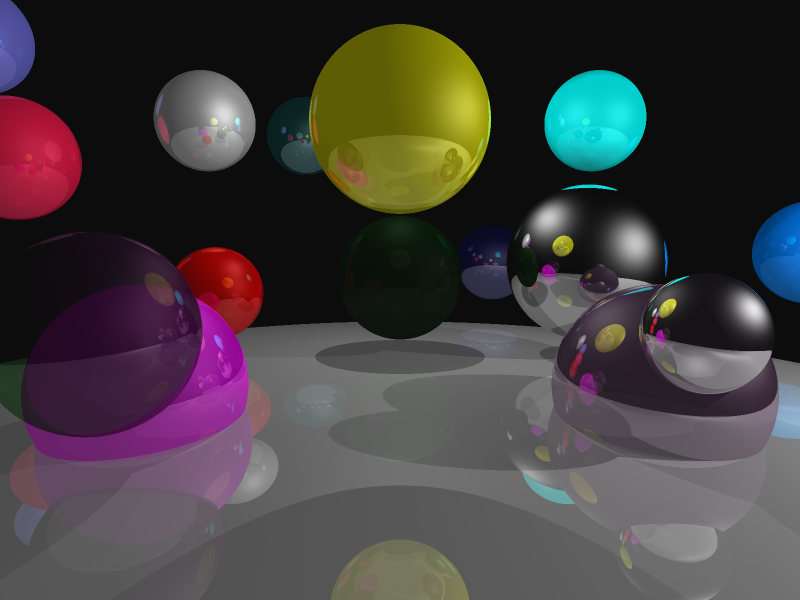
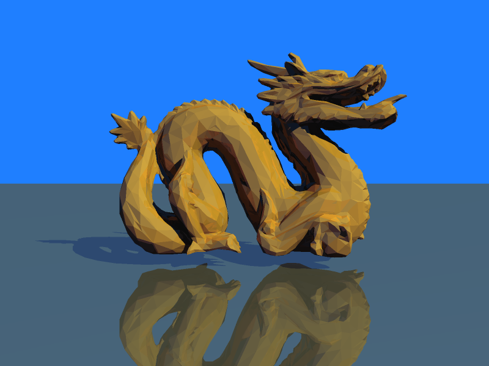
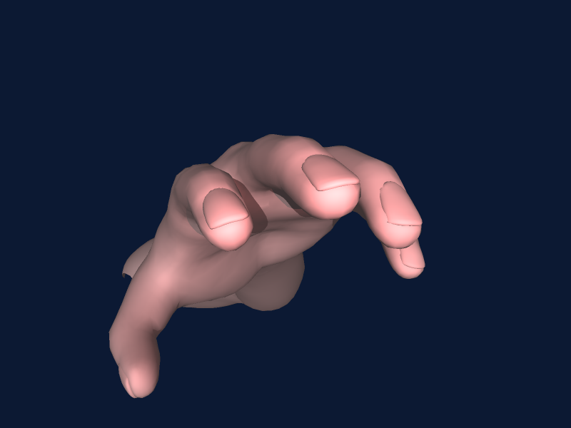
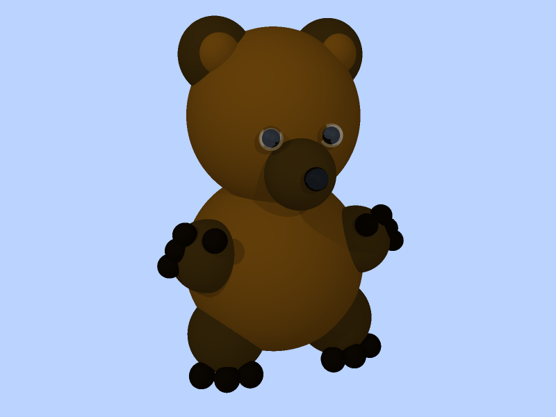
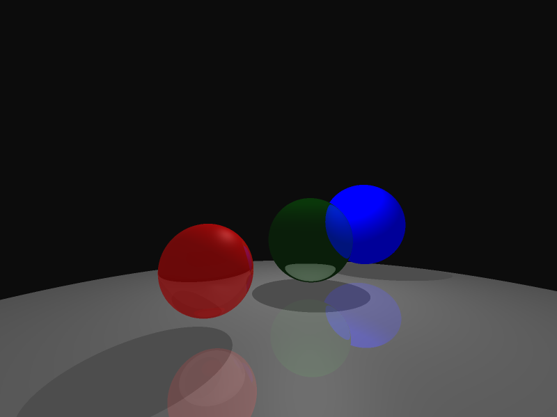

## Overview

This is a ray tracing renderer implementation that reads scene description files and generates photorealistic images. The raytracer supports:
- Spheres and triangles as geometric primitives
- Multiple light types (point, directional, spot)
- Blinn-Phong shading with shadows
- Reflection and refraction for recursive ray tracing
- 2x2 supersampling for anti-aliasing
- OpenMP parallelization for performance
- BVH to accelerate rendering times








## Build and Run Commands

### Compilation
```bash
g++ -fsanitize=address -std=c++11 -fopenmp rayTrace_vec3.cpp -o ray
```

### Running the Raytracer
```bash
./ray <scene_file.txt>
```

Example:
```bash
./ray Examples/spheres1.txt
```

### Main Components

1. **rayTrace_vec3.cpp** - Main raytracer implementation
   - `main()`: Entry point, parses scene, renders image with OpenMP parallelization
   - `traceRay()`: Recursive ray tracing with reflection/refraction support (depth-limited by `max_depth`)
   - `raySphereIntersect()`: Ray-sphere intersection test
   - `rayTriangleIntersect()`: Möller-Trumbore ray-triangle intersection
   - `calculateColor()`: Blinn-Phong shading with shadow rays for all light types
   - `reflect()` / `refract()`: Reflection and refraction ray calculation

2. **vec3.h** - Vector math and scene data structures
   - `vec3`: 3D vector with operations (dot, cross, normalized, length)
   - `Sphere`, `Triangle`: Geometric primitives with material indices
   - `material`: Phong material (ambient, diffuse, specular, shininess, transparency, IOR)
   - `light`, `spotlight`: Light source definitions

3. **parse_vec3.h** - Scene file parser and global state
   - `parseSceneFile()`: Parses text-based scene description files
   - Global vectors: `spheres`, `triangles`, `vertices`, `normals`, `materials`, `point_lights`, `directional_lights`
   - Camera parameters: `eye`, `forward`, `up`, `right`, `halfAngleVFOV`
   - Image settings: `img_width`, `img_height`, `imgName`

4. **image_lib.h** - Image I/O wrapper around stb_image
   - `Image`: RGB image class with `setPixel()`, `write()` methods
   - `Color`: RGB float color struct

### Scene File Format

Scene files (`.txt`) are line-based with `command: parameters` format. Key commands:
- `camera_pos:`, `camera_fwd:`, `camera_up:`, `camera_fov_ha:` - Camera setup
- `image_resolution:`, `output_image:` - Image settings
- `material:` - Set current material (14 floats: ar ag ab dr dg db sr sg sb ns tr tg tb ior)
- `sphere:` - Add sphere (x y z radius, uses current material)
- `vertex:`, `normal:`, `triangle:`, `normal_triangle:` - Triangle mesh definition
- `point_light:`, `directional_light:`, `spot_light:` - Light sources
- `ambient_light:`, `background:` - Scene-wide settings
- `max_depth:` - Recursion limit for reflection/refraction

### Material State Pattern

The parser maintains a "current material" state. When a `material:` line is parsed, subsequent geometry (spheres, triangles) inherit that material by storing `materials.size() - 1` as their `matIndex`. To modify materials: adjust existing entries or insert new `material:` commands before geometry in scene files.

### Intersection and Shading Flow

1. For each pixel (with 2x2 subsamples), compute ray direction from camera
2. `traceRay()` finds nearest intersection across all spheres and triangles
3. Calculate normal (sphere: geometric normal; triangle: interpolated vertex normals if available)
4. `calculateColor()` performs shadow tests against all geometry for each light source
5. If material has reflectivity (sr,sg,sb) or transparency (tr,tg,tb), spawn recursive rays
6. Combine local shading + weighted reflected/refracted colors

### Key Implementation Details

- **Attenuation**: Point/spot lights use 1/r² falloff; directional lights have no falloff
- **Backface handling**: Triangle normals are flipped if `dot(normal, rayDir) > 0`
- **Parallelization**: OpenMP parallelizes the outer pixel loop (`#pragma omp parallel for` at line 320)
- **Progress tracking**: Uses `std::atomic<int>` for thread-safe progress counter

## Testing Scenes

Example scenes are in `SphereExamples/`:
- `spheres1.txt` - Basic multi-sphere scene with reflections
- `triangle.txt` - Simple triangle test
- `bear.txt`, `dragon.txt` - Complex triangle mesh models
